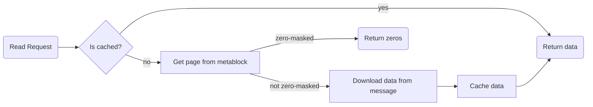
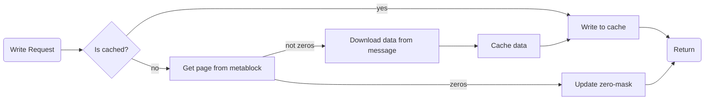
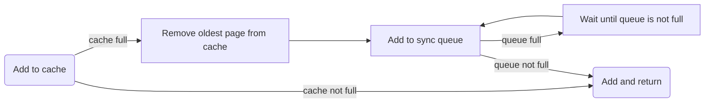
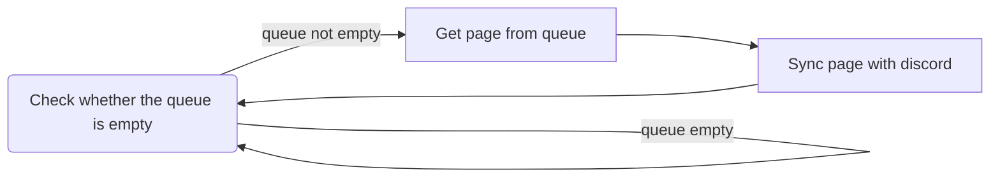
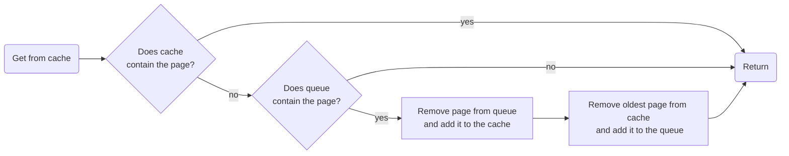

# DAAFS Technical Info

This document describes how DAAFS works for those who are curious.

## Basics

DAAFS uses tool named nbdkit, which allows you to create NBD servers with ease. It also allows you to write plugins for it, which is what DAAFS is.

More info about nbdkit can be found [here](https://gitlab.com/nbdkit/nbdkit).

## Reads

When daafs receives a read request, it first checks if the page containing the requested data is cached. If it is, it just returns the data from the cache. However, if it isn't, it looks at the metablocks to find id of the message containing the data. Then, before downloading data from the message, it checks if selected block has a zero-mask enabled. If it does, it just returns zeros. If it doesn't, it downloads the data from the message, caches it and returns it.

Here is a diagram of how it works:

## Writes

When daafs receives a write request, it also first checks if the page containing the requested data is cached. If it is, it just writes the data to the cache. However, if it isn't, it looks at the metablocks to find id of the message containing the data. Then, before downloading data from the message, it checks whether data in the message is just zeros. If it is, it just updates the zero-mask. If it isn't, it downloads the data from the message, caches it and writes the data to the cache.

Here is a diagram of how it works:

## Flushes

When daafs receives a flush request, it clears the cache putting all pages into the sync queue and waits until the sync queue is empty.

Then it moves all metablocks to the bottom of the chat to make sure that it is easy to find all the metablocks.

## Syncing

As you may have noticed, there is no way to write data to the actual message. This is because it would be too slow to do it every time someone writes to the disk. Instead, daafs uses cache with a sync queue. When write or read request is received, it first goes to the cache, but cache has a limit of 4 pages. If the cache is full, oldest page is removed from the cache and added to the sync queue.

Sync queue works as a separate thread that waits until something is added to it. Then it takes all pages one by one and writes them to the discord slowly syncing them with the actual discord drive. This way, it's much faster than writing to the discord every time someone writes to the disk.

_Note_: Once queue reaches 4 pages (which is also the cache limit), it waits until there is a free space in the queue.

## Here is a diagram of how it works:

### Adding to cache/queue

### Syncing thread

## What if queue has not yet synced page that is requested?

In all diagrams above, there is a little catch in a place where it checks whether the page is cached. It is not only checking whether the page is cached, but also whether the page is in the queue. In case it is, it removes the page from the queue and puts it back to the cache adding oldest page to the queue. This way, it is guaranteed that the data is up to date.

Here is a diagram of how it works:

## Known issues

There is an edge case where the queue is syncing a page and someone requests the same page. In this case, the page is already removed from the queue but not yet synced with discord. This means that it is possible that daafs will return old data. Although, this is very unlikely to happen I still need to fix it.
